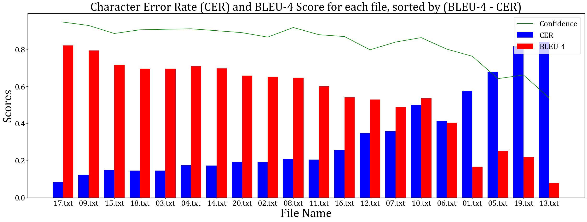
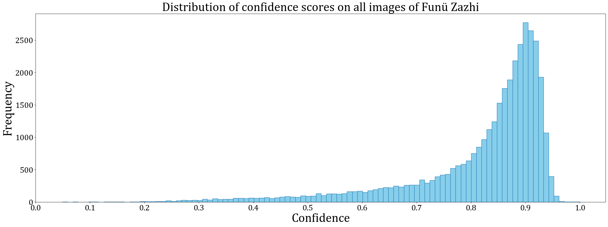
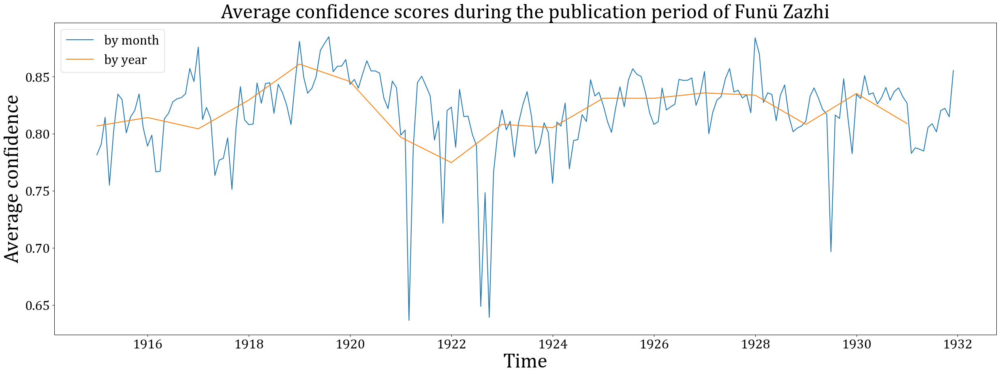
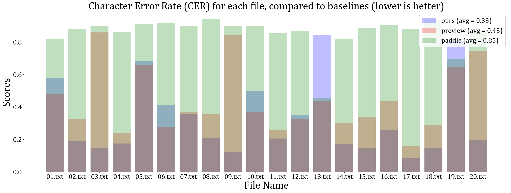
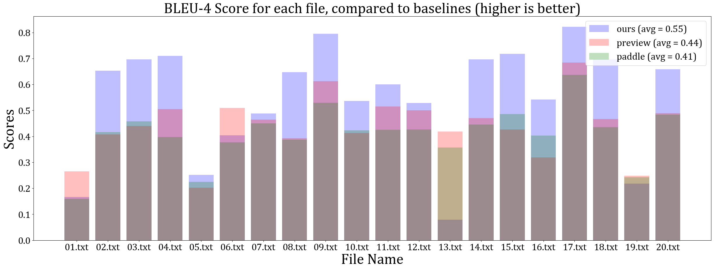

---
geometry:
- margin = 3cm
---

# MSc Individual Project Progress Report

Michael Song (02405765) on 07 August

## Progress before last meeting

- Background and progress report
- Data collection (journal images with labels)
- Synthetic datasets for training
- Trained following models:
  - Text Line Detector (LD), based on Faster-RCNN
  - Text Line Recognizer (LR), based on CRNN
  - Character Detector (CD), based on Faster-RCNN
  - Character Recognizer (CR), based on Faster-RCNN
  - Character Classifier (CC), based on ResNet
- Compared the performance with following methods:
  - CR
  - CD + CC
  - LD + CR
  - LD + CD + CC
  - LD + LR
- **LD + LR** is better and chosen for further improvement
  - LD performs well on the most common layout.
  - LR only performs well on train/validation set, **but not** on target images.
    - The synthetic training set may not fully matches the target data.
  - Both LD and LR are only trained on vertical text images.
- Manual text extraction performed on 20 images as **testing set**.
- **LD** Model Training:
  - Synthetic dataset with random layouts and icon integration.
  - Extensive data augmentation techniques used.
- **LR** Model Training:
  - Combined vertical and horizontal text, frequency-based character selection.
  - Typeface variety increased from 1 to 4.
  - Extensive data augmentation applied.
- Results:
  - LD and LR can handle diverse text layouts.
  - LD is better at ignoring non-text areas.
  - LR shows reduced over-fitting.
- Metrics:
  - Inference speed: **0.8** sec/image.
  - CER: **0.44**
  - BLEU-4: **0.41**
- Comparison with Baseline:
  - Outperforms Apple's OCR engine in CER and BLEU-4.
- Processed textual data from 35,851 journal images.
- Training pipeline improvement:
  - Typeface variety increased from 4 to 12
  - Wider range of data augmentation
  - LR model architecture adjustment
  - Introduce **word-based** character selection in training data
- Improved result:
  - Average CER improved to **0.33** for 20 images
    - **0.28** for 17 common layout images
    - Less than **0.2** on half of the images
  - Average BLEU-4 improved to **0.55** for 20 images
    - **0.62** for 17 common layout images
- User interface:
  - Load and display image locally
  - Zoom and shift the image
  - Perform OCR on the image
  - Show the results of both detection and recognition
  - Switch between traditional and simplified Chinese

## Progress since last meeting

### Confidence Scores

- **Idea**: the average output value from the **recognition** model for each character
  - For example, the output text for a file is "ABCD", 
  - assuming there are only 4 characters in the database,
  - the raw output from the recognition model may be:
  - [[0.1, 0.2, **0.4**, 0.3], [**0.4**, 0.2, 0.1, 0.3], [0.1, **0.4**, 0.2, 0.3], [0.1, 0.2, 0.3, **0.4**]],
  - the index of the item with the highest **value** will be decoded to character,
  - the average of these **values** will be used as confidence score, which in this case is 0.4
- The prediction with a higher confidence score is theoretically more accurate.
- Relation to other metrics:
- 
- Distribution of confidence scores on all 36,101 journal pages:
- 
  - Around 30% have a confidence score higher than 0.9 (CER < 0.15 in general)
  - Around 70% have a confidence score higher than 0.8 (CER < 0.20 in general)
- Average confidence scores during the publication period:
- 

### Baseline Comparison

- Apple Preview and PaddleOCR (v4)
- 
- 
- CER of PaddleOCR is very high as it orders the textlines from left to right
- Our models still lack performance on horizontal text, as the training data is designed to have much more **vertical text** to match the distribution of target data.

## Future work

- Final report

## Questions

- Report structure