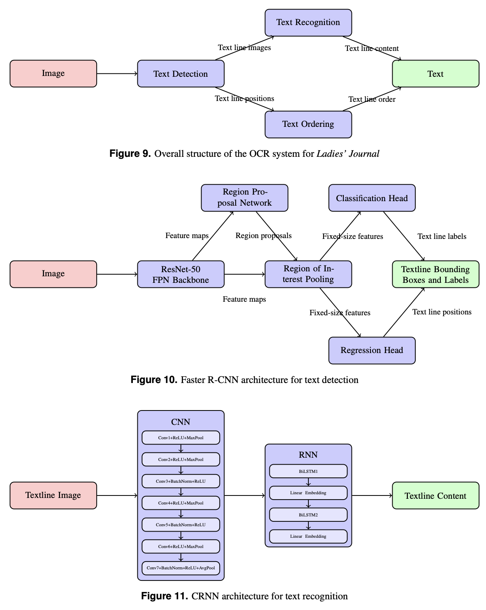
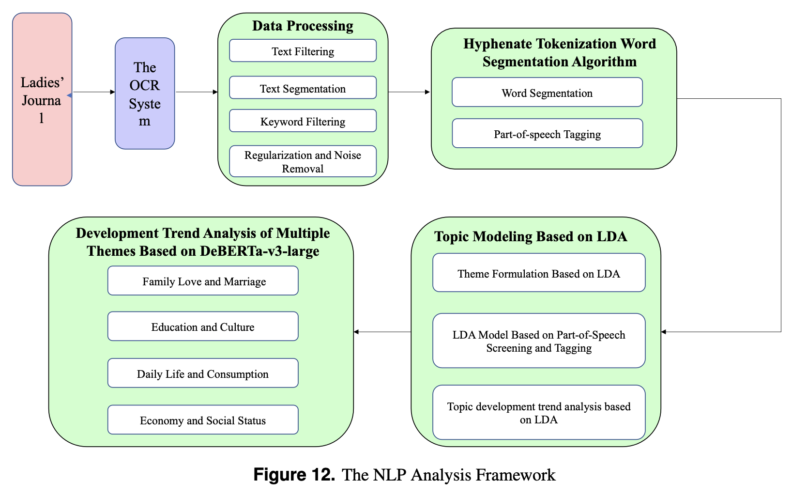
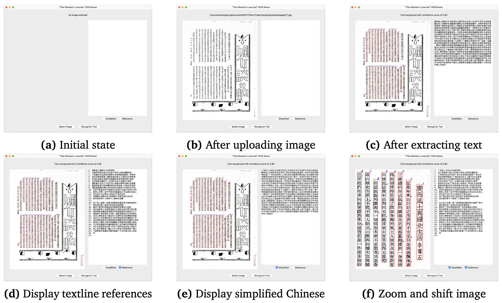
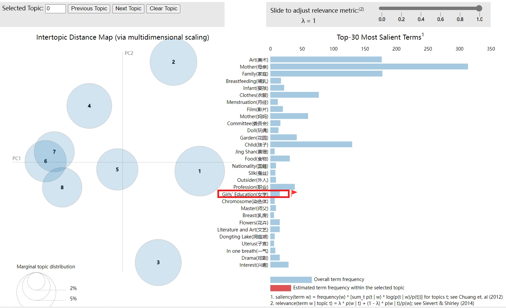

# Exploring women's image evolution in modern Chinese literature through machine learning techniques: a case study of 'The Ladies’ journal' (Funü zazhi)

Michael Song, Chen Feng, Weihang Zhang, Pancham Shukla, Debbie Junqi Fan, Wendy Wang, and Sibo Cheng

[[Paper]()] [[OCR system](./OCR/)] [[NLP system](./NLP/)]

## Project Introduction

This project investigates the evolution of women's social roles in modern Chinese literature, focusing on *The Ladies’ Journal* (Funü zazhi, 1915–1931). The study leverages machine learning techniques—specifically Optical Character Recognition (OCR) and Natural Language Processing (NLP)—to digitize and analyze over 36,000 pages of historical Chinese texts. The aim is to enable systematic, reproducible, and large-scale analysis of gender discourse and social attitudes in early 20th-century China.

Key challenges addressed include:
- Low-resolution, complex-layout scanned images.
- Lack of annotated datasets for training OCR models.
- The need for accurate text extraction and robust topic modeling in historical Chinese.

## Methods

### OCR System

The OCR pipeline consists of three main modules:
1. **Text Detection**: Based on Faster R-CNN, detects text lines in scanned images.
2. **Text Recognition**: Uses a CRNN model to recognize the content of each detected text line.
3. **Text Ordering**: Applies rule-based algorithms to reconstruct the correct reading order, handling both vertical and horizontal layouts.

Synthetic datasets were generated to train detection and recognition models, simulating the visual style and layout of *The Ladies’ Journal*. The OCR system outperforms state-of-the-art tools (PaddleOCR, EasyOCR, Tesseract, Apple Preview) on this challenging dataset.

### NLP Analysis

After digitization, the text is processed using a custom NLP pipeline:
- **Data Filtering**: Retain only high-confidence OCR outputs.
- **Segmentation**: Divide text into manageable chunks for topic modeling.
- **Keyword Extraction**: Use KeyBERT (DeBERTa-based) for relevant keyword identification.
- **Word Segmentation**: Combine Jieba and Topwords-seg with a novel hyphenated tokenization algorithm for improved segmentation of historical Chinese.
- **Topic Modeling**: Apply LDA to classify documents into five main themes: Daily Life and Consumption, Economic and Social Status, Education and Culture, Family, Love and Marriage, and Health and Medicine.
- **Trend Analysis**: Use DeBERTa-v3-large for multi-dimensional sentiment and keyword trend analysis over time.

## Results

- The OCR system achieves over 90% recognition accuracy on high-confidence pages, with an average inference speed of 2.88s/image (GPU).
- Compared to baselines, the system shows higher mean average precision (mAP), lower character error rate (CER), and higher BLEU-4 scores.
- LDA topic modeling reveals five major themes in the journal, with significant growth in discussions of women’s economic and social status after 1919.
- Trend analysis shows a shift from traditional family roles to modern views on love, marriage, and social participation.
- The NLP framework enables customizable keyword analysis, supporting flexible exploration of gender discourse trends.

## Getting Started

- See [OCR/README.md](OCR/README.md) for OCR system setup, training, and evaluation.
- See [NLP/readme.md](NLP/readme.md) for NLP analysis workflow and requirements.
- Source code for OCR and NLP modules is in [OCR/src/](OCR/src/) and [NLP/src/](NLP/src/), respectively.
- Example notebooks and evaluation scripts/results are in [OCR/notebooks/](OCR/notebooks/) and [NLP/results/](NLP/results/).